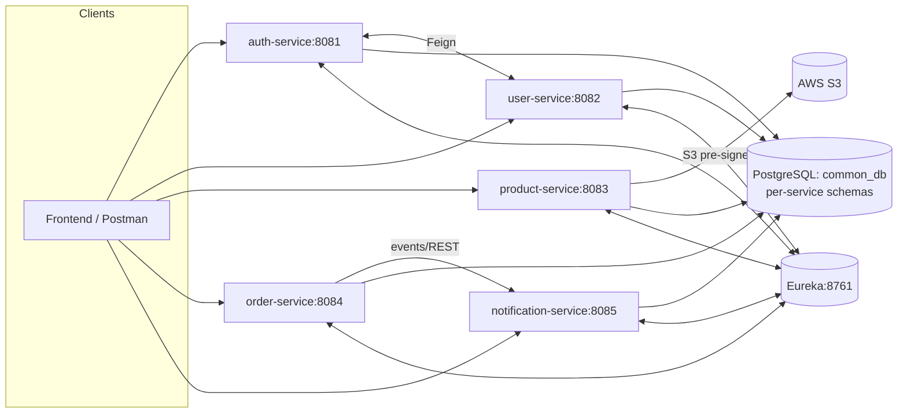

# e-commerce-platform

A microservices **e‑commerce** platform built with **Java 21** and **Spring Boot 3**.  
It demonstrates production‑style practices: **JWT** auth, service‑to‑service calls via **OpenFeign + Eureka**, **PostgreSQL** with **Liquibase**, **AWS S3** file storage using **pre‑signed URLs**, input validation, centralized error handling, and tests with **Testcontainers**.

> **Modules in this monorepo:** `auth-service`, `user-service`, `product-service`, `order-service`, `notification-service`, `eureka`.

---

## Architecture



---

## Modules & Ports

| Service | Purpose | Port |
|---|---|---|
| **eureka** | Service registry | **8761** |
| **auth-service** | Registration/login, JWT issuing | **8081** |
| **user-service** | User management | **8082** |
| **product-service** | Product catalog, filters/sorting, S3 pre‑signed URLs | **8083** |
| **order-service** | Orders | **8084** |
| **notification-service** | Notifications (REST/events) | **8085** |

---

## Tech Stack

Java 21 • Spring Boot 3 • Spring Web • Spring Data JPA • Spring Security (JWT) •  
Spring Cloud (OpenFeign, Eureka Client/Server) • PostgreSQL • Liquibase • AWS S3 (SDK v2, pre‑signed URLs) •  
Maven (multi‑module) • MapStruct • Lombok • JUnit/MockMvc • **Testcontainers** • Docker/Compose

---

## Repository Layout (example)

```
e-commerce-platform/
├─ pom.xml                 # parent (packaging=pom)
├─ eureka/
├─ auth-service/
├─ user-service/
├─ product-service/
├─ order-service/
├─ notification-service/
├─ docker-compose.yml
└─ README.md
```

---

## Prerequisites

- JDK **21**
- Maven **3.8+**
- Docker + Docker Compose (Docker **must be running** for tests that use Testcontainers)
- AWS account and an S3 bucket (for product images)

---

## Configuration

All services use the same PostgreSQL database **`common_db`** with **separate schemas** per service, e.g.:  
`auth_schema`, `user_schema`, `product_schema`, `order_schema`, `notification_schema`.

Create *local* config files (do **not** commit them):

```
<service>/src/main/resources/application-local.yml
```

**Template (example for `auth-service`; adjust port/schema per service):**
```yaml
server:
  port: 8081

spring:
  application:
    name: auth-service
  datasource:
    url: jdbc:postgresql://localhost:5432/common_db?currentSchema=auth_schema
    username: username
    password: password
  jpa:
    hibernate:
      ddl-auto: validate
    properties:
      hibernate:
        default_schema: auth_schema
  liquibase:
    change-log: classpath:db/changelog/db.changelog-master.xml

eureka:
  client:
    serviceUrl:
      defaultZone: http://localhost:8761/eureka/

# For services that interact with S3 (e.g., product-service)
aws:
  s3:
    bucket-name: your-bucket
    region: us-east-1
    access-key: ${AWS_ACCESS_KEY}
    secret-key: ${AWS_SECRET_KEY}

spring:
  servlet:
    multipart:
      max-file-size: 5MB
      max-request-size: 10MB
```

> Keep real secrets in `application-local.yml` or environment variables and add them to `.gitignore`.

---

## Infrastructure (Docker)

A root-level `docker-compose.yml` is provided for local infrastructure (e.g., PostgreSQL).  
Start it with:
```bash
docker compose up -d
# PostgreSQL will be on 5432; other services depend on your compose file
```
If compose includes DB init scripts, schemas can be created automatically; otherwise create schemas in the first Liquibase changeset (recommended per service).

---

## Run Locally (suggested order)

> **Eureka does not require strict order**, but for a smoother dev experience it’s convenient to start the registry first, then provider services, then consumers (to avoid transient "no instances available" during early Feign calls).

1) **Eureka**
```bash
mvn -pl eureka spring-boot:run
# http://localhost:8761
```

2) **User → Auth → Product → Order → Notification**
```bash
mvn -pl user-service spring-boot:run
mvn -pl auth-service spring-boot:run
mvn -pl product-service spring-boot:run
mvn -pl order-service spring-boot:run
mvn -pl notification-service spring-boot:run
```

Run services with the `local` profile as needed:
```bash
mvn -pl auth-service spring-boot:run -Dspring-boot.run.profiles=local
```

---

## Authentication (JWT)

1) Login in `auth-service` → receive `accessToken`.
2) Send it to protected endpoints:
```
Authorization: Bearer <JWT>
```
3) Each service is configured with Spring Security/JWT validation filters.

---

## Database Migrations

Each service contains its own `db/changelog/db.changelog-master.xml`.  
Liquibase runs on startup and migrates **only its own schema**.

---

## Tests (with Testcontainers)

- Unit/web tests use JUnit/MockMvc where applicable.
- **Integration tests spin up PostgreSQL using Testcontainers.** Ensure **Docker** is installed and running before tests, otherwise they’ll fail to start the container.
- Typical command:
```bash
mvn -B -ntp test
```
You can also run a specific module:
```bash
mvn -pl product-service -Dtest=*Test test
```

---

# e-commerce-platform (RU)

Микросервисная **e‑commerce** платформа на **Java 21** и **Spring Boot 3**.  
Демонстрирует практики: аутентификация **JWT**, вызовы между сервисами (**OpenFeign + Eureka**), **PostgreSQL** с **Liquibase**, хранилище **AWS S3** через **pre‑signed URLs**, валидация, централизованная обработка ошибок и тесты с **Testcontainers**.

> **Модули:** `auth-service`, `user-service`, `product-service`, `order-service`, `notification-service`, `eureka`.

---

## Архитектура


---

## Модули и порты

| Сервис | Назначение | Порт |
|---|---|---|
| **eureka** | Реестр сервисов | **8761** |
| **auth-service** | Регистрация/логин, выдача JWT | **8081** |
| **user-service** | Управление пользователями | **8082** |
| **product-service** | Каталог, фильтры/сортировки, S3 pre‑signed URLs | **8083** |
| **order-service** | Заказы | **8084** |
| **notification-service** | Уведомления (REST/события) | **8085** |

---

## Технологии

Java 21 • Spring Boot 3 • Spring Web • Spring Data JPA • Spring Security (JWT) •  
Spring Cloud (OpenFeign, Eureka) • PostgreSQL • Liquibase • AWS S3 (SDK v2, pre‑signed URLs) •  
Maven (multi‑module) • MapStruct • Lombok • JUnit/MockMvc • **Testcontainers** • Docker/Compose

---

## Структура репозитория (пример)

```
e-commerce-platform/
├─ pom.xml                 # parent (packaging=pom)
├─ eureka/
├─ auth-service/
├─ user-service/
├─ product-service/
├─ order-service/
├─ notification-service/
├─ docker-compose.yml
└─ README.md
```

---

## Предусловия

- JDK **21**
- Maven **3.8+**
- Docker + Docker Compose (**Docker должен быть запущен** для тестов на Testcontainers)
- Аккаунт AWS и S3‑бакет (для изображений товаров)

---

## Конфигурация

Все сервисы используют одну БД **`common_db`** с **отдельными схемами** на сервис:  
`auth_schema`, `user_schema`, `product_schema`, `order_schema`, `notification_schema`.

Создай *локальные* конфиги (не коммитить):

```
<service>/src/main/resources/application-local.yml
```

**Шаблон (`auth-service`; поменяй порт/схему под сервис):**
```yaml
server:
  port: 8081

spring:
  application:
    name: auth-service
  datasource:
    url: jdbc:postgresql://localhost:5432/common_db?currentSchema=auth_schema
    username: username
    password: password
  jpa:
    hibernate:
      ddl-auto: validate
    properties:
      hibernate:
        default_schema: auth_schema
  liquibase:
    change-log: classpath:db/changelog/db.changelog-master.xml

eureka:
  client:
    serviceUrl:
      defaultZone: http://localhost:8761/eureka/

# Для сервисов, работающих с S3 (например, product-service)
aws:
  s3:
    bucket-name: your-bucket
    region: us-east-1
    access-key: ${AWS_ACCESS_KEY}
    secret-key: ${AWS_SECRET_KEY}

spring:
  servlet:
    multipart:
      max-file-size: 5MB
      max-request-size: 10MB
```

> Секреты держи в `application-local.yml`/переменных окружения и добавь в `.gitignore`.

---

## Инфраструктура (Docker)

В корне есть `docker-compose.yml` для локальной инфраструктуры (например, PostgreSQL).  
Запуск:
```bash
docker compose up -d
# PostgreSQL будет на 5432; остальное зависит от содержимого compose
```
Если compose содержит init‑скрипты БД, схемы создадутся автоматически; иначе создай схемы первым changeset’ом Liquibase (рекомендовано).

---

## Запуск локально (рекомендуемый порядок)

> **Eureka не требует строгого порядка**, но удобнее сначала поднять реестр, затем поставщиков, потом потребителей — меньше «No instances available» в первые секунды.

1) **Eureka**
```bash
mvn -pl eureka spring-boot:run
# http://localhost:8761
```

2) **User → Auth → Product → Order → Notification**
```bash
mvn -pl user-service spring-boot:run
mvn -pl auth-service spring-boot:run
mvn -pl product-service spring-boot:run
mvn -pl order-service spring-boot:run
mvn -pl notification-service spring-boot:run
```

Профиль `local` при необходимости:
```bash
mvn -pl auth-service spring-boot:run -Dspring-boot.run.profiles=local
```

---

## Аутентификация (JWT)

1) Логин в `auth-service` → получаем `accessToken`.
2) Передаём его в защищённые эндпоинты:
```
Authorization: Bearer <JWT>
```
3) В каждом сервисе настроены фильтры Spring Security для проверки токена.

---

## Миграции БД

В каждом сервисе свой `db/changelog/db.changelog-master.xml`.  
Liquibase запускается при старте и мигрирует **только свою схему**.

---

## Тесты (с Testcontainers)

- Unit/web‑тесты — JUnit/MockMvc (где применимо).
- **Интеграционные тесты поднимают PostgreSQL через Testcontainers.** Убедись, что **Docker** установлен и запущен перед стартом тестов.
- Запуск всех тестов:
```bash
mvn -B -ntp test
```
Запуск модульных тестов только для одного сервиса:
```bash
mvn -pl product-service -Dtest=*Test test
```

